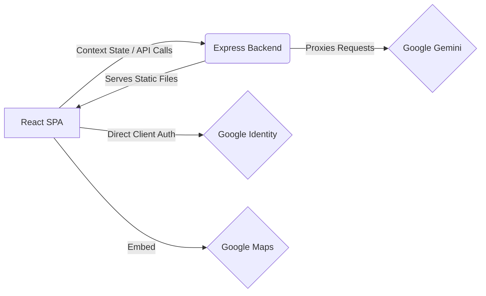

# ElectionAssist (Hackathon MVP)

> Built during PromptWars to explore how offline-first guidance and conversational interfaces can improve accessibility to election information.

ElectionAssist is a hackathon MVP built to simplify the voting journey for first-time Indian voters. The application combines an offline rule-based guidance engine with optional Google services (Gemini AI, Maps, Identity) to provide educational, state-aware assistance throughout the voting process.

The application is deployed on Google Cloud Run and uses Google Gemini, Maps, and Identity services where available.

## Demo

- **Live Demo**: (https://electionassist-570282205129.us-central1.run.app/)


## Tech Stack

| Layer | Technology |
|---|---|
| **Frontend** | React + Vite |
| **Backend** | Express (Node.js) |
| **AI** | Google Gemini (2.0-flash) |
| **Deployment** | Docker + Google Cloud Run |
| **Testing** | Vitest |

## Key Features

* **Offline-First Philosophy:** The core educational and voting guide workflows function purely offline via local keyword-matching engines, ensuring high uptime and accessibility even on poor networks.
* **Accessibility First:**
  * Browser-native Speech Recognition
  * Text-to-Speech (TTS) integration
  * Zero-dependency High-contrast mode
  * Easy Mode (text scaling and simplified vocabulary)

## Architecture

The project uses a single-container Client-Server architecture. The backend explicitly acts as a proxy for Google Gemini to ensure that API keys are never exposed to the client browser.



## Core Components

* **State Engine (`AppContext.jsx`):** Manages user session, stage progression, and accessibility modifiers, persisting to `localStorage`.
* **Context & Fallback Engines (`contextEngine.js`, `fallbackEngine.js`):** Lightweight rule-based intent routing that maps user queries to relevant guidance and UI panels without requiring network requests.
* **Chat Interface (`Chat.jsx`):** The primary conversational UI, integrating natively with the Web Speech API.
* **Dynamic Panels:** Contextual tools that open based on user stage or intent, including a Readiness Checklist, Journey Timeline, simulated Voting Booth, and Candidate list.
* **Maps Integration (`MapView.jsx`):** A Google Maps Embed API implementation providing polling booth searches and Street View.

## Testing

Includes lightweight Vitest unit tests for the local routing, fallback engine, and misinformation helper. Run them locally using `npm run test`.

## Project Structure

```text
├── server/
│   └── index.js             # Express backend (static server, API proxy, mock stores)
├── src/
│   ├── components/          # React UI components (Chat, Maps, Simulator, etc.)
│   ├── context/             # AppContext for global state management
│   ├── services/            # API client and Gemini service wrappers
│   ├── utils/               # Local logic (context routing, fallback, speech, a11y)
│   ├── __tests__/           # Vitest unit test suite
│   ├── App.jsx              # Main layout and view router
│   └── main.jsx             # React entry point
├── Dockerfile               # Multi-stage Docker build configuration
├── vite.config.js           # Vite & Vitest configuration
└── package.json             # Dependencies and scripts
```

## Running Locally

### Prerequisites
* Node.js (v18 or v20 recommended)
* A Google Gemini API Key
* A Google Maps API Key (Optional, but required for map views)
* A Google Client ID (Optional, for Google Sign-In)

### Setup

1. Install dependencies:
   ```bash
   npm install
   ```
2. Set up environment variables in a `.env` file:
   ```env
   GEMINI_API_KEY="your_gemini_api_key_here"
   VITE_GOOGLE_MAPS_API_KEY="your_maps_key_here"
   VITE_GOOGLE_CLIENT_ID="your_google_client_id_here"
   ```
3. Start the development environment:
   ```bash
   npm run dev
   ```

## Docker Setup

```bash
docker build -t election-assist \
  --build-arg VITE_GOOGLE_MAPS_API_KEY=your_key \
  --build-arg VITE_GOOGLE_CLIENT_ID=your_key \
  .

docker run -p 8080:8080 -e GEMINI_API_KEY=your_key election-assist
```

## Known Limitations

* **In-Memory Storage:** The backend stores user sessions and voter applications in JavaScript memory objects. Data is lost upon server restart and does not support horizontal scaling.
* **Authentication Security:** Google Sign-In JWTs are decoded locally via `atob` without backend signature validation. *(Note: This is a known demo limitation intended for hackathon review, do not use this pattern in production.)*
* **Mock Data:** Candidate lists and Voter ID applications are simulations and not connected to live ECI databases.
* **Simple Misinformation Guard:** The misinformation filter relies on basic keyword matching and can be bypassed.

## Lessons Learned

Building the MVP highlighted several improvements required before production deployment:
- Replace in-memory storage with a persistent database.
- Verify Google Identity tokens on the backend.
- Integrate verified Election Commission data sources instead of relying on mock data.
- Improve misinformation detection beyond keyword-based matching.
